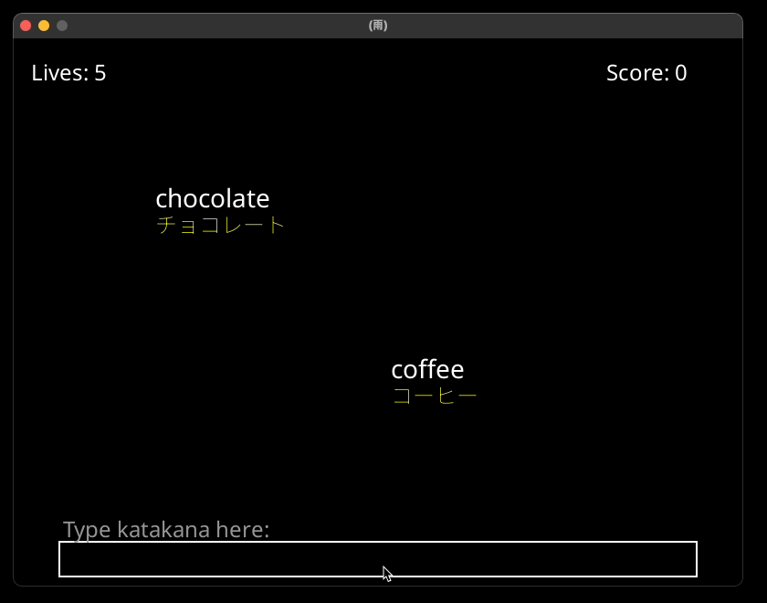

# b （雨）

This repository is participate for `Build Games with Amazon Q CLI and score a T shirt 🏆👕` event.

<p align="center">
  <a href="https://community.aws/content/2xIoduO0xhkhUApQpVUIqBFGmAc/build-games-with-amazon-q-cli-and-score-a-t-shirt?trk=769a1a2b-8c19-4976-9c45-b6b1226c7d20&sc_channel=el">
    <picture>
      
    </picture>
  </a>
</p>

Inspired by [한컴타자연습 산성비](https://namu.wiki/w/%ED%95%9C%EC%BB%B4%ED%83%80%EC%9E%90%EC%97%B0%EC%8A%B5%202007#s-6.1)

## Game Play

<p align="center">
    <picture>
      
    </picture>
</p>

## English-Japanese Katakana Word Game

A pygame-ce based word matching game where English words fall from the top of the screen, and the player needs to type their Japanese katakana equivalents before they reach the bottom.

### Game Features

- Words fall from the top of the screen like rain
- Type the Japanese katakana equivalent to make the word disappear
- 5 lives - lose a life when a word reaches the bottom
- Game over screen shows matched word pairs, score, and play time
- Restart option to play again

### How to Run

```bash
pip install
python rain_words_game.py
```

### Requirements

- Python 3.x
- pygame-ce

### Word Pairs

Word pairs are stored in `word_pairs.txt` in the format: `english_word, japanese_katakana`
